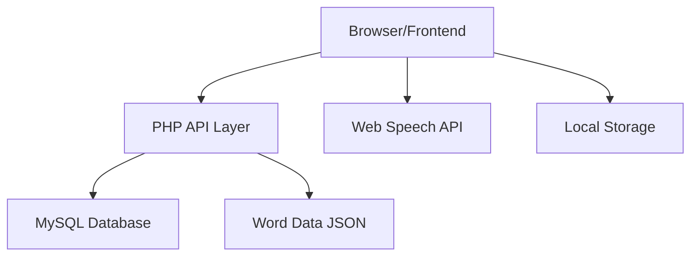

# Design Document

## Overview

The Word Builder game is a web-based educational application designed as a proof-of-concept for EAL (English as an Additional Language) learning. The system follows a clean separation of concerns with a PHP/MySQL backend providing RESTful APIs and a vanilla JavaScript frontend delivering interactive gameplay. The architecture prioritizes simplicity, demonstrating core competencies while remaining implementable within a 3-day development window.

## Architecture

### High-Level Architecture



### Technology Stack

**Backend:**
- PHP 8.0+ with PDO for database operations
- MySQL 8.0 for data persistence
- JSON files for word/image data (for demo simplicity)
- Apache/Nginx web server

**Frontend:**
- Vanilla JavaScript (ES6+) for game logic
- CSS3 with Flexbox/Grid for responsive layout
- HTML5 Drag and Drop API
- Web Speech API for pronunciation
- Local Storage for offline capability

**Development Tools:**
- Composer for PHP dependency management
- Simple file structure for rapid development
- Git for version control

### Design Aesthetic

**Visual Design Principles:**
- **Minimal & Clean** - Focus on functionality over decoration
- **Glassy Modern UI** - Subtle transparency effects and soft shadows
- **High Contrast** - Ensure accessibility for all learners
- **Large Touch Targets** - Optimized for mobile and young learners
- **Consistent Spacing** - Clean grid system throughout

**Color Palette:**
- Primary: Soft blues and greens (calming, educational)
- Success: Gentle green with subtle animation
- Error: Warm orange (encouraging, not harsh red)
- Background: Light grays with glass-morphism effects
- Text: High contrast dark grays for readability

**Typography:**
- Clean, rounded sans-serif fonts
- Large, readable sizes for young learners
- Clear hierarchy between headings and body text

## Components and Interfaces

### Backend Components

#### 1. API Controller (`api/index.php`)
Central routing for all API endpoints with proper HTTP method handling.

```php
// Example endpoint structure
GET  /api/progress/{sessionId}     - Retrieve player progress
POST /api/progress                 - Save progress data
GET  /api/words/{level}           - Get words for specific level
GET  /api/levels                  - Get available difficulty levels
GET  /api/teacher/sessions         - Get all active sessions for teacher view
GET  /api/teacher/progress/{sessionId} - Get detailed progress for teacher
POST /api/teacher/session          - Create new student session
```

#### 2. Progress Manager (`classes/ProgressManager.php`)
Handles all progress tracking operations with EAL-specific metrics.

```php
class ProgressManager {
    public function saveProgress($sessionId, $level, $score, $accuracy);
    public function getProgress($sessionId);
    public function calculateNextLevel($currentProgress);
    public function getPerformanceMetrics($sessionId);
}
```

#### 3. Word Manager (`classes/WordManager.php`)
Manages word data and difficulty progression logic.

```php
class WordManager {
    public function getWordsForLevel($level);
    public function validateWord($word, $userInput);
    public function getWordImage($word);
    public function calculateDifficulty($word);
}
```

#### 4. Teacher Manager (`classes/TeacherManager.php`)
Handles teacher dashboard functionality and session management.

```php
class TeacherManager {
    public function getAllSessions();
    public function createStudentSession($studentName);
    public function getSessionProgress($sessionId);
    public function getErrorPatterns($sessionId);
    public function generateProgressReport($sessionId);
}
```

#### 5. Database Layer (`classes/Database.php`)
Simple PDO wrapper with connection management and basic CRUD operations.

### Frontend Components

#### 1. Game Engine (`js/game.js`)
Core game logic managing state, progression, and user interactions.

```javascript
class WordBuilderGame {
    constructor(containerId) {
        this.currentLevel = 1;
        this.currentWord = null;
        this.score = 0;
        this.sessionId = this.generateSessionId();
    }
    
    async loadLevel(level) { /* Load words and setup UI */ }
    handleLetterDrag(event) { /* Drag and drop logic */ }
    checkWord() { /* Validate completed word */ }
    playPronunciation(word) { /* Web Speech API integration */ }
    saveProgress() { /* API call to save progress */ }
}
```

#### 2. Teacher Dashboard (`js/teacher.js`)
Simple teacher interface for session management and progress viewing.

```javascript
class TeacherDashboard {
    constructor() {
        this.sessions = [];
        this.currentView = 'overview';
    }
    
    async loadAllSessions() { /* Fetch all student sessions */ }
    createNewSession(studentName) { /* Create new student session */ }
    viewSessionProgress(sessionId) { /* Show detailed progress */ }
    generateProgressReport(sessionId) { /* Create printable report */ }
    showErrorPatterns(sessionId) { /* Display common mistakes */ }
}
```

#### 3. UI Manager (`js/ui.js`)
Handles all visual feedback, animations, and responsive behavior.

```javascript
class UIManager {
    showSuccess(word) { /* Success animations and feedback */ }
    showError(gentle = true) { /* Gentle error feedback */ }
    updateProgressBar(progress) { /* Visual progress indication */ }
    adaptToScreenSize() { /* Responsive layout adjustments */ }
    renderProgressChart(data) { /* Simple charts for teacher view */ }
}
```

#### 4. Audio Manager (`js/audio.js`)
Manages pronunciation using Web Speech API with fallback options.

```javascript
class AudioManager {
    pronounceWord(word) { /* Web Speech API implementation */ }
    playSuccessSound() { /* Positive feedback sounds */ }
    playErrorSound() { /* Gentle error sounds */ }
}
```

#### 5. Progress Tracker (`js/progress.js`)
Client-side progress management with offline capability.

```javascript
class ProgressTracker {
    saveToLocal(data) { /* Local storage backup */ }
    syncWithServer() { /* Sync local data with backend */ }
    getOfflineProgress() { /* Retrieve offline progress */ }
}
```

## Data Models

### Database Schema

#### Sessions Table
```sql
CREATE TABLE sessions (
    id INT PRIMARY KEY AUTO_INCREMENT,
    session_id VARCHAR(255) UNIQUE NOT NULL,
    student_name VARCHAR(100) NOT NULL,
    created_at TIMESTAMP DEFAULT CURRENT_TIMESTAMP,
    last_active TIMESTAMP DEFAULT CURRENT_TIMESTAMP,
    INDEX idx_session_id (session_id)
);
```

#### Progress Table
```sql
CREATE TABLE progress (
    id INT PRIMARY KEY AUTO_INCREMENT,
    session_id VARCHAR(255) NOT NULL,
    level INT NOT NULL,
    words_completed INT DEFAULT 0,
    total_attempts INT DEFAULT 0,
    correct_attempts INT DEFAULT 0,
    current_streak INT DEFAULT 0,
    best_streak INT DEFAULT 0,
    time_spent INT DEFAULT 0, -- seconds
    last_played TIMESTAMP DEFAULT CURRENT_TIMESTAMP,
    created_at TIMESTAMP DEFAULT CURRENT_TIMESTAMP,
    FOREIGN KEY (session_id) REFERENCES sessions(session_id),
    INDEX idx_session (session_id),
    INDEX idx_level (level)
);
```

#### Word Attempts Table (for detailed analytics)
```sql
CREATE TABLE word_attempts (
    id INT PRIMARY KEY AUTO_INCREMENT,
    session_id VARCHAR(255) NOT NULL,
    word VARCHAR(50) NOT NULL,
    level INT NOT NULL,
    attempts INT DEFAULT 1,
    success BOOLEAN DEFAULT FALSE,
    time_taken INT DEFAULT 0, -- seconds
    error_pattern VARCHAR(255), -- for EAL analysis
    created_at TIMESTAMP DEFAULT CURRENT_TIMESTAMP,
    INDEX idx_session_word (session_id, word)
);
```

### Word Data Structure

Words are stored in JSON files organized by difficulty level:

```json
{
  "level_1": {
    "name": "Simple CVC Words",
    "words": [
      {
        "word": "cat",
        "image": "images/cat.jpg",
        "phonetic": "/kæt/",
        "difficulty": 1,
        "category": "animals"
      },
      {
        "word": "dog",
        "image": "images/dog.jpg", 
        "phonetic": "/dɒɡ/",
        "difficulty": 1,
        "category": "animals"
      }
    ]
  }
}
```

### Progress Data Model

```javascript
// Client-side progress object
const progressData = {
    sessionId: "unique-session-id",
    currentLevel: 1,
    totalScore: 0,
    wordsCompleted: 0,
    accuracy: 0.85,
    currentStreak: 3,
    bestStreak: 7,
    timeSpent: 1200, // seconds
    lastPlayed: "2024-01-15T10:30:00Z",
    levelProgress: {
        1: { completed: true, score: 100, attempts: 5 },
        2: { completed: false, score: 60, attempts: 3 }
    }
};
```

## Error Handling

### Backend Error Handling

```php
// Standardized API error responses
class APIResponse {
    public static function error($message, $code = 400) {
        http_response_code($code);
        return json_encode([
            'success' => false,
            'error' => $message,
            'timestamp' => date('c')
        ]);
    }
    
    public static function success($data) {
        return json_encode([
            'success' => true,
            'data' => $data,
            'timestamp' => date('c')
        ]);
    }
}
```

### Frontend Error Handling

```javascript
// Graceful error handling with user-friendly messages
class ErrorHandler {
    static handleAPIError(error) {
        console.error('API Error:', error);
        // Show gentle message to user, don't break game flow
        UIManager.showMessage('Having trouble saving progress, but you can keep playing!');
    }
    
    static handleOfflineMode() {
        UIManager.showMessage('Playing offline - progress will sync when connection returns');
        // Enable offline mode features
    }
}
```

## Testing Strategy

### Backend Testing

1. **Unit Tests** for core classes (ProgressManager, WordManager)
2. **API Integration Tests** for all endpoints
3. **Database Tests** for data integrity and performance

```php
// Example test structure
class ProgressManagerTest extends PHPUnit\Framework\TestCase {
    public function testSaveProgress() {
        // Test progress saving with various scenarios
    }
    
    public function testLevelProgression() {
        // Test EAL-appropriate level advancement logic
    }
}
```

### Frontend Testing

1. **Manual Testing** across devices and browsers
2. **Game Flow Testing** for complete user journeys
3. **Accessibility Testing** for inclusive design

```javascript
// Example test scenarios
const testScenarios = [
    'Complete word successfully',
    'Handle incorrect letter placement', 
    'Progress through multiple levels',
    'Offline mode functionality',
    'Mobile touch interactions'
];
```

### EAL-Specific Testing

1. **Pedagogical Validation** - Ensure difficulty progression aligns with language learning principles
2. **Error Pattern Analysis** - Test common EAL learner mistakes are handled appropriately
3. **Feedback Effectiveness** - Validate that feedback supports rather than discourages learning

## Performance Considerations

### Backend Optimization

- **Database Indexing** on frequently queried fields (session_id, level)
- **JSON Caching** for word data to reduce file I/O
- **Connection Pooling** for database efficiency
- **API Response Compression** for faster data transfer

### Frontend Optimization

- **Lazy Loading** of images and audio resources
- **Local Caching** of word data for offline play
- **Debounced API Calls** to prevent excessive server requests
- **CSS Animations** over JavaScript for smooth performance
- **Touch Event Optimization** for mobile responsiveness

### Scalability Considerations

While this is a proof-of-concept, the architecture supports future scaling:

- **Modular Design** allows easy addition of new game types
- **RESTful API** can be extended for additional features
- **Session-based Progress** can evolve into full user accounts
- **JSON Word Data** can migrate to database for dynamic content management

## Security Considerations

### Data Protection

- **Input Validation** on all API endpoints
- **SQL Injection Prevention** using prepared statements
- **XSS Protection** through proper output encoding
- **Session Security** with secure session ID generation

### Privacy Compliance

- **Minimal Data Collection** - only game progress, no personal information
- **Data Retention** policies for demo purposes
- **Transparent Data Usage** clearly documented

This design balances technical demonstration with practical implementation constraints, showcasing understanding of both web development best practices and EAL learning principles while remaining achievable within the 3-day development timeline.