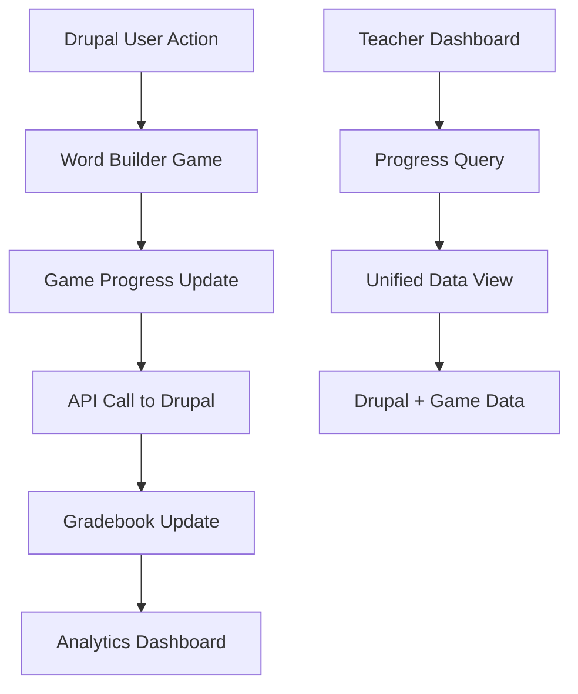

# Drupal Integration Guide
## EAL Word Builder Game Integration with Drupal 7-11

This document outlines strategies for integrating the EAL Word Builder Game with Drupal-based learning management systems, including migration considerations from Drupal 7 to Drupal 11.

## 🎯 Integration Overview

The Word Builder Game is designed as a standalone application that can be integrated with Drupal in multiple ways, supporting both current Drupal installations and future migration paths.

### Integration Benefits

- **Seamless User Experience**: Single sign-on with Drupal user accounts
- **Grade Synchronization**: Automatic progress updates to Drupal gradebook
- **Content Management**: Leverage Drupal's content management for word lists and curricula
- **Reporting Integration**: Unified analytics across all learning activities
- **Scalable Architecture**: Supports growth from small classrooms to district-wide deployment

## 🏗️ Integration Architectures

### 1. Embedded Module Integration (Recommended)

Best for: Drupal 8+ installations with custom module development capabilities

```php
<?php
// modules/word_builder/src/Controller/GameController.php

namespace Drupal\word_builder\Controller;

use Drupal\Core\Controller\ControllerBase;
use Drupal\Core\Session\AccountInterface;
use Symfony\Component\DependencyInjection\ContainerInterface;

class GameController extends ControllerBase {
    
    protected $currentUser;
    
    public function __construct(AccountInterface $current_user) {
        $this->currentUser = $current_user;
    }
    
    public static function create(ContainerInterface $container) {
        return new static(
            $container->get('current_user')
        );
    }
    
    /**
     * Embed the Word Builder Game in a Drupal page
     */
    public function embedGame($course_id = null) {
        // Generate secure session token
        $session_token = $this->generateSecureToken();
        
        // Create game session linked to Drupal user
        $game_session = $this->createGameSession([
            'drupal_user_id' => $this->currentUser->id(),
            'drupal_username' => $this->currentUser->getAccountName(),
            'course_id' => $course_id,
            'session_token' => $session_token
        ]);
        
        return [
            '#theme' => 'word_builder_game',
            '#game_config' => [
                'session_id' => $game_session['session_id'],
                'api_endpoint' => '/word-builder/api',
                'user_name' => $this->currentUser->getDisplayName(),
                'course_id' => $course_id,
                'auth_token' => $session_token
            ],
            '#attached' => [
                'library' => ['word_builder/game'],
                'drupalSettings' => [
                    'wordBuilder' => [
                        'apiEndpoint' => '/word-builder/api',
                        'sessionId' => $game_session['session_id'],
                        'authToken' => $session_token
                    ]
                ]
            ]
        ];
    }
    
    /**
     * API endpoint for game data
     */
    public function apiProxy($endpoint) {
        // Validate user session
        if (!$this->validateSession()) {
            return new JsonResponse(['error' => 'Unauthorized'], 401);
        }
        
        // Proxy request to Word Builder API
        return $this->proxyToGameAPI($endpoint);
    }
    
    private function createGameSession($user_data) {
        // Call Word Builder API to create session
        $api_client = \Drupal::service('word_builder.api_client');
        return $api_client->createSession($user_data);
    }
    
    private function generateSecureToken() {
        return bin2hex(random_bytes(32));
    }
}
```

### 2. External Tool Integration (LTI)

Best for: Existing Drupal installations with LTI support

```php
<?php
// LTI Provider implementation

class WordBuilderLTIProvider {
    
    /**
     * Handle LTI launch request from Drupal
     */
    public function handleLaunch($request) {
        // Validate LTI request
        if (!$this->validateLTIRequest($request)) {
            throw new AccessDeniedHttpException('Invalid LTI request');
        }
        
        // Extract user and course information
        $user_id = $request->get('user_id');
        $course_id = $request->get('context_id');
        $user_name = $request->get('lis_person_name_full');
        $user_email = $request->get('lis_person_contact_email_primary');
        
        // Create game session
        $session_data = [
            'lti_user_id' => $user_id,
            'course_id' => $course_id,
            'user_name' => $user_name,
            'user_email' => $user_email,
            'return_url' => $request->get('launch_presentation_return_url'),
            'outcome_service_url' => $request->get('lis_outcome_service_url'),
            'result_sourcedid' => $request->get('lis_result_sourcedid')
        ];
        
        $game_session = $this->createGameSession($session_data);
        
        // Redirect to game with session
        return $this->redirectToGame($game_session['session_id']);
    }
    
    /**
     * Grade passback to Drupal gradebook
     */
    public function gradePassback($session_id, $score) {
        $session = $this->getGameSession($session_id);
        
        if (!$session['outcome_service_url']) {
            return false; // No grade passback configured
        }
        
        // Prepare LTI outcome request
        $outcome_request = $this->buildOutcomeRequest([
            'service_url' => $session['outcome_service_url'],
            'sourcedid' => $session['result_sourcedid'],
            'score' => $score / 100, // Convert to 0-1 scale
            'result_data' => $this->generateResultData($session_id)
        ]);
        
        // Send grade to Drupal
        return $this->sendOutcomeRequest($outcome_request);
    }
    
    private function generateResultData($session_id) {
        $progress = $this->getProgressData($session_id);
        
        return [
            'words_completed' => $progress['total_words_completed'],
            'accuracy' => $progress['overall_accuracy'],
            'time_spent' => $progress['total_time_spent'],
            'levels_completed' => $progress['levels_completed'],
            'error_patterns' => $progress['common_errors']
        ];
    }
}
```

### 3. REST API Integration

Best for: Headless Drupal or custom integration scenarios

```javascript
// Drupal-side JavaScript integration
(function ($, Drupal, drupalSettings) {
    'use strict';
    
    Drupal.behaviors.wordBuilderIntegration = {
        attach: function (context, settings) {
            // Initialize Word Builder with Drupal context
            const gameConfig = {
                apiEndpoint: settings.wordBuilder.apiEndpoint,
                sessionId: settings.wordBuilder.sessionId,
                authToken: settings.wordBuilder.authToken,
                onProgressUpdate: this.handleProgressUpdate,
                onGameComplete: this.handleGameComplete
            };
            
            // Initialize game
            const game = new WordBuilderGame('game-container', gameConfig);
            
            // Set up periodic progress sync
            setInterval(() => {
                this.syncProgressToDrupal(game.getProgress());
            }, 30000); // Sync every 30 seconds
        },
        
        handleProgressUpdate: function(progress) {
            // Send progress update to Drupal
            $.ajax({
                url: '/word-builder/sync-progress',
                method: 'POST',
                data: {
                    session_id: progress.sessionId,
                    progress_data: JSON.stringify(progress),
                    _token: drupalSettings.wordBuilder.authToken
                },
                success: function(response) {
                    console.log('Progress synced to Drupal');
                },
                error: function(xhr, status, error) {
                    console.error('Failed to sync progress:', error);
                }
            });
        },
        
        handleGameComplete: function(finalScore, sessionData) {
            // Send final grade to Drupal gradebook
            $.ajax({
                url: '/word-builder/submit-grade',
                method: 'POST',
                data: {
                    session_id: sessionData.sessionId,
                    final_score: finalScore,
                    completion_data: JSON.stringify(sessionData),
                    _token: drupalSettings.wordBuilder.authToken
                },
                success: function(response) {
                    // Redirect back to course or show completion message
                    if (response.return_url) {
                        window.location.href = response.return_url;
                    }
                }
            });
        }
    };
    
})(jQuery, Drupal, drupalSettings);
```

## 🔄 Migration Strategy: Drupal 7 to 11

### Phase 1: Assessment and Planning

#### Current State Analysis
```sql
-- Analyze existing Drupal 7 data structure
SELECT 
    n.title as course_name,
    u.name as instructor,
    COUNT(DISTINCT ur.uid) as student_count,
    AVG(g.grade) as average_grade
FROM node n
JOIN users u ON n.uid = u.uid
JOIN user_roles ur ON ur.rid = 3 -- Student role
JOIN gradebook_grades g ON g.nid = n.nid
WHERE n.type = 'course'
GROUP BY n.nid;
```

#### Migration Requirements
- **User Data**: Preserve student accounts and enrollment history
- **Course Structure**: Maintain course organization and content
- **Grade History**: Migrate existing gradebook data
- **Content**: Preserve custom word lists and curriculum materials

### Phase 2: Parallel Deployment

#### Drupal 7 Integration (Temporary)
```php
<?php
// Drupal 7 module implementation
function word_builder_menu() {
    $items = array();
    
    $items['word-builder/game/%'] = array(
        'title' => 'Word Builder Game',
        'page callback' => 'word_builder_game_page',
        'page arguments' => array(2),
        'access arguments' => array('access word builder'),
        'type' => MENU_CALLBACK,
    );
    
    return $items;
}

function word_builder_game_page($course_nid) {
    global $user;
    
    // Create game session for Drupal 7 user
    $session_data = array(
        'drupal_user_id' => $user->uid,
        'drupal_username' => $user->name,
        'course_nid' => $course_nid,
        'user_roles' => array_keys($user->roles)
    );
    
    $game_session = word_builder_create_session($session_data);
    
    // Embed game interface
    drupal_add_js(array(
        'wordBuilder' => array(
            'sessionId' => $game_session['session_id'],
            'apiEndpoint' => '/word-builder/api',
            'userId' => $user->uid
        )
    ), 'setting');
    
    drupal_add_js(drupal_get_path('module', 'word_builder') . '/js/word-builder-integration.js');
    
    return theme('word_builder_game', array(
        'session_id' => $game_session['session_id'],
        'user_name' => $user->name
    ));
}
```

### Phase 3: Drupal 8/9 Migration

#### Data Migration Pipeline
```php
<?php
// Migration plugin for Drupal 8+

namespace Drupal\word_builder\Plugin\migrate\source;

use Drupal\migrate\Plugin\migrate\source\SqlBase;

/**
 * @MigrateSource(
 *   id = "word_builder_sessions",
 *   source_module = "word_builder"
 * )
 */
class WordBuilderSessions extends SqlBase {
    
    public function query() {
        return $this->select('word_builder_sessions', 'wbs')
            ->fields('wbs')
            ->condition('wbs.created', strtotime('-1 year'), '>')
            ->orderBy('wbs.created', 'DESC');
    }
    
    public function fields() {
        return [
            'session_id' => $this->t('Session ID'),
            'drupal_user_id' => $this->t('Drupal User ID'),
            'course_nid' => $this->t('Course Node ID'),
            'progress_data' => $this->t('Progress Data'),
            'created' => $this->t('Created Date'),
            'last_active' => $this->t('Last Active Date')
        ];
    }
    
    public function getIds() {
        return [
            'session_id' => [
                'type' => 'string',
                'length' => 255
            ]
        ];
    }
}
```

#### Migration Configuration
```yaml
# config/install/migrate_plus.migration.word_builder_sessions.yml
id: word_builder_sessions
label: Word Builder Game Sessions
migration_group: word_builder
source:
  plugin: word_builder_sessions
  database_state_key: drupal_7
destination:
  plugin: entity:word_builder_session
process:
  session_id: session_id
  user_id:
    plugin: migration_lookup
    migration: upgrade_d7_user
    source: drupal_user_id
  course_id:
    plugin: migration_lookup
    migration: upgrade_d7_node_course
    source: course_nid
  progress_data:
    plugin: callback
    callable: json_decode
    source: progress_data
  created:
    plugin: format_date
    from_format: 'U'
    to_format: 'Y-m-d\TH:i:s'
    source: created
migration_dependencies:
  required:
    - upgrade_d7_user
    - upgrade_d7_node_course
```

### Phase 4: Drupal 10/11 Optimization

#### Modern API Integration
```php
<?php
// Drupal 10/11 service implementation

namespace Drupal\word_builder\Service;

use Drupal\Core\Config\ConfigFactoryInterface;
use Drupal\Core\Session\AccountInterface;
use GuzzleHttp\ClientInterface;
use Psr\Log\LoggerInterface;

class WordBuilderApiService {
    
    protected $httpClient;
    protected $config;
    protected $currentUser;
    protected $logger;
    
    public function __construct(
        ClientInterface $http_client,
        ConfigFactoryInterface $config_factory,
        AccountInterface $current_user,
        LoggerInterface $logger
    ) {
        $this->httpClient = $http_client;
        $this->config = $config_factory->get('word_builder.settings');
        $this->currentUser = $current_user;
        $this->logger = $logger;
    }
    
    /**
     * Create a new game session
     */
    public function createSession(array $user_data): array {
        try {
            $response = $this->httpClient->post($this->getApiEndpoint() . '/sessions', [
                'json' => [
                    'drupal_user_id' => $user_data['user_id'],
                    'user_name' => $user_data['user_name'],
                    'course_id' => $user_data['course_id'] ?? null,
                    'user_roles' => $user_data['roles'] ?? [],
                    'created_by' => 'drupal_' . \Drupal::VERSION
                ],
                'headers' => [
                    'Authorization' => 'Bearer ' . $this->getApiToken(),
                    'Content-Type' => 'application/json'
                ]
            ]);
            
            return json_decode($response->getBody(), true);
            
        } catch (\Exception $e) {
            $this->logger->error('Failed to create Word Builder session: @error', [
                '@error' => $e->getMessage()
            ]);
            throw $e;
        }
    }
    
    /**
     * Sync progress data to Drupal
     */
    public function syncProgress(string $session_id, array $progress_data): bool {
        // Update Drupal gradebook
        $grade_service = \Drupal::service('gradebook.grade_manager');
        
        $grade_data = [
            'user_id' => $progress_data['drupal_user_id'],
            'course_id' => $progress_data['course_id'],
            'activity_id' => 'word_builder_' . $session_id,
            'grade' => $this->calculateGrade($progress_data),
            'max_grade' => 100,
            'feedback' => $this->generateFeedback($progress_data)
        ];
        
        return $grade_service->updateGrade($grade_data);
    }
    
    private function calculateGrade(array $progress_data): float {
        // EAL-specific grading algorithm
        $accuracy_weight = 0.6;
        $completion_weight = 0.3;
        $engagement_weight = 0.1;
        
        $accuracy_score = $progress_data['overall_accuracy'] * 100;
        $completion_score = min(100, ($progress_data['levels_completed'] / 3) * 100);
        $engagement_score = min(100, ($progress_data['total_time_spent'] / 1800) * 100);
        
        return ($accuracy_score * $accuracy_weight) + 
               ($completion_score * $completion_weight) + 
               ($engagement_score * $engagement_weight);
    }
    
    private function generateFeedback(array $progress_data): string {
        $feedback = [];
        
        if ($progress_data['overall_accuracy'] >= 0.9) {
            $feedback[] = "Excellent accuracy! You're mastering English vocabulary.";
        } elseif ($progress_data['overall_accuracy'] >= 0.7) {
            $feedback[] = "Good progress! Keep practicing to improve accuracy.";
        } else {
            $feedback[] = "Focus on accuracy. Review the words you found challenging.";
        }
        
        if ($progress_data['levels_completed'] >= 3) {
            $feedback[] = "Great job completing multiple difficulty levels!";
        }
        
        if (!empty($progress_data['common_errors'])) {
            $error_types = array_keys($progress_data['common_errors']);
            $feedback[] = "Focus on: " . implode(', ', $error_types);
        }
        
        return implode(' ', $feedback);
    }
}
```

## 📊 Data Synchronization

### Real-time Sync Architecture



### Sync Configuration
```php
<?php
// Synchronization service configuration

class SyncConfiguration {
    const SYNC_INTERVALS = [
        'real_time' => 0,      // Immediate sync
        'frequent' => 30,      // Every 30 seconds
        'moderate' => 300,     // Every 5 minutes
        'batch' => 3600        // Hourly batch sync
    ];
    
    const SYNC_TRIGGERS = [
        'level_complete' => 'real_time',
        'session_end' => 'real_time',
        'progress_update' => 'frequent',
        'error_pattern' => 'moderate',
        'analytics_data' => 'batch'
    ];
    
    public static function getSyncInterval($trigger_type): int {
        return self::SYNC_INTERVALS[self::SYNC_TRIGGERS[$trigger_type]] ?? 300;
    }
}
```

## 🔐 Security Considerations

### Authentication Flow
```php
<?php
// Secure authentication between Drupal and Word Builder

class SecureAuthenticationService {
    
    /**
     * Generate secure session token
     */
    public function generateSessionToken(int $user_id, string $course_id): string {
        $payload = [
            'user_id' => $user_id,
            'course_id' => $course_id,
            'issued_at' => time(),
            'expires_at' => time() + 3600, // 1 hour
            'issuer' => 'drupal_' . \Drupal::VERSION
        ];
        
        return $this->createJWT($payload);
    }
    
    /**
     * Validate session token
     */
    public function validateSessionToken(string $token): array {
        try {
            $payload = $this->verifyJWT($token);
            
            // Check expiration
            if ($payload['expires_at'] < time()) {
                throw new \Exception('Token expired');
            }
            
            // Verify user still has access
            $user = \Drupal\user\Entity\User::load($payload['user_id']);
            if (!$user || !$user->isActive()) {
                throw new \Exception('User not found or inactive');
            }
            
            return $payload;
            
        } catch (\Exception $e) {
            \Drupal::logger('word_builder')->error('Token validation failed: @error', [
                '@error' => $e->getMessage()
            ]);
            throw $e;
        }
    }
    
    private function createJWT(array $payload): string {
        // Implementation using Firebase JWT or similar library
        return \Firebase\JWT\JWT::encode($payload, $this->getSecretKey(), 'HS256');
    }
    
    private function verifyJWT(string $token): array {
        return (array) \Firebase\JWT\JWT::decode($token, $this->getSecretKey(), ['HS256']);
    }
    
    private function getSecretKey(): string {
        return \Drupal::state()->get('word_builder.jwt_secret') ?: 
               $this->generateAndStoreSecret();
    }
}
```

### Data Privacy Compliance
```php
<?php
// GDPR/Privacy compliance for educational data

class PrivacyComplianceService {
    
    /**
     * Handle data export request
     */
    public function exportUserData(int $user_id): array {
        return [
            'user_info' => $this->getUserInfo($user_id),
            'game_sessions' => $this->getGameSessions($user_id),
            'progress_data' => $this->getProgressData($user_id),
            'analytics_data' => $this->getAnalyticsData($user_id),
            'export_date' => date('c'),
            'retention_policy' => $this->getRetentionPolicy()
        ];
    }
    
    /**
     * Handle data deletion request
     */
    public function deleteUserData(int $user_id): bool {
        try {
            // Anonymize rather than delete for educational analytics
            $this->anonymizeGameSessions($user_id);
            $this->anonymizeProgressData($user_id);
            
            // Delete personally identifiable information
            $this->deletePIIData($user_id);
            
            return true;
            
        } catch (\Exception $e) {
            \Drupal::logger('word_builder')->error('Data deletion failed: @error', [
                '@error' => $e->getMessage()
            ]);
            return false;
        }
    }
    
    private function anonymizeGameSessions(int $user_id): void {
        // Replace user identifiers with anonymous tokens
        $anonymous_id = 'anon_' . hash('sha256', $user_id . time());
        
        \Drupal::database()->update('word_builder_sessions')
            ->fields(['user_id' => $anonymous_id, 'user_name' => 'Anonymous'])
            ->condition('user_id', $user_id)
            ->execute();
    }
}
```

## 📈 Performance Optimization

### Caching Strategy
```php
<?php
// Intelligent caching for Drupal integration

class CacheOptimizationService {
    
    /**
     * Cache game data with appropriate TTL
     */
    public function cacheGameData(string $cache_key, array $data, string $data_type): void {
        $cache_tags = ['word_builder', 'word_builder:' . $data_type];
        $expire = $this->getCacheExpiration($data_type);
        
        \Drupal::cache()->set($cache_key, $data, $expire, $cache_tags);
    }
    
    /**
     * Invalidate cache when data changes
     */
    public function invalidateGameCache(array $cache_tags): void {
        \Drupal\Core\Cache\Cache::invalidateTags($cache_tags);
    }
    
    private function getCacheExpiration(string $data_type): int {
        $expirations = [
            'user_progress' => 300,      // 5 minutes
            'word_lists' => 3600,        // 1 hour
            'analytics' => 1800,         // 30 minutes
            'session_data' => 600        // 10 minutes
        ];
        
        return time() + ($expirations[$data_type] ?? 900);
    }
}
```

## 🧪 Testing Integration

### Automated Testing Suite
```php
<?php
// Integration tests for Drupal compatibility

namespace Drupal\Tests\word_builder\Functional;

use Drupal\Tests\BrowserTestBase;

class WordBuilderIntegrationTest extends BrowserTestBase {
    
    protected static $modules = ['word_builder', 'user', 'node'];
    
    /**
     * Test game session creation
     */
    public function testGameSessionCreation(): void {
        // Create test user
        $user = $this->createUser(['access word builder']);
        $this->drupalLogin($user);
        
        // Create test course
        $course = $this->createNode(['type' => 'course']);
        
        // Test session creation
        $this->drupalGet('/word-builder/game/' . $course->id());
        $this->assertSession()->statusCodeEquals(200);
        $this->assertSession()->pageTextContains('Word Builder Game');
        
        // Verify session data in database
        $sessions = \Drupal::database()
            ->select('word_builder_sessions', 'wbs')
            ->fields('wbs')
            ->condition('drupal_user_id', $user->id())
            ->execute()
            ->fetchAll();
            
        $this->assertCount(1, $sessions);
        $this->assertEquals($course->id(), $sessions[0]->course_id);
    }
    
    /**
     * Test grade synchronization
     */
    public function testGradeSynchronization(): void {
        $user = $this->createUser(['access word builder']);
        $course = $this->createNode(['type' => 'course']);
        
        // Simulate game completion
        $progress_data = [
            'session_id' => 'test_session_123',
            'drupal_user_id' => $user->id(),
            'course_id' => $course->id(),
            'overall_accuracy' => 0.85,
            'levels_completed' => 2,
            'total_time_spent' => 1200
        ];
        
        $api_service = \Drupal::service('word_builder.api_service');
        $result = $api_service->syncProgress('test_session_123', $progress_data);
        
        $this->assertTrue($result);
        
        // Verify grade in gradebook
        $grade = \Drupal::database()
            ->select('gradebook_grades', 'gg')
            ->fields('gg')
            ->condition('user_id', $user->id())
            ->condition('activity_id', 'word_builder_test_session_123')
            ->execute()
            ->fetchObject();
            
        $this->assertNotNull($grade);
        $this->assertGreaterThan(70, $grade->grade); // Should be around 79 based on algorithm
    }
}
```

## 📋 Implementation Checklist

### Pre-Integration Assessment
- [ ] **Drupal Version Identification**: Determine current Drupal version and upgrade timeline
- [ ] **User Management Analysis**: Document current user roles and permissions structure
- [ ] **Gradebook Integration**: Identify existing gradebook system and API capabilities
- [ ] **Content Structure Review**: Analyze course and curriculum content organization
- [ ] **Performance Requirements**: Establish performance benchmarks and scalability needs

### Development Phase
- [ ] **API Development**: Create secure API endpoints for Drupal communication
- [ ] **Authentication System**: Implement secure token-based authentication
- [ ] **Data Synchronization**: Build real-time and batch sync mechanisms
- [ ] **Grade Integration**: Develop gradebook synchronization functionality
- [ ] **User Interface**: Create Drupal-integrated game interface
- [ ] **Admin Interface**: Build configuration and management interfaces

### Testing Phase
- [ ] **Unit Testing**: Test individual integration components
- [ ] **Integration Testing**: Test full Drupal-to-game workflow
- [ ] **Performance Testing**: Validate performance under load
- [ ] **Security Testing**: Verify authentication and data protection
- [ ] **User Acceptance Testing**: Test with actual teachers and students

### Deployment Phase
- [ ] **Staging Deployment**: Deploy to staging environment for final testing
- [ ] **Data Migration**: Migrate existing user and course data if applicable
- [ ] **Production Deployment**: Deploy to production with monitoring
- [ ] **User Training**: Train teachers and administrators on new functionality
- [ ] **Documentation**: Provide comprehensive user and admin documentation

### Post-Deployment
- [ ] **Monitoring Setup**: Implement performance and error monitoring
- [ ] **Backup Procedures**: Establish data backup and recovery procedures
- [ ] **Update Procedures**: Document update and maintenance procedures
- [ ] **Support Processes**: Establish user support and troubleshooting processes

## 📞 Support and Resources

### Technical Support
- **Integration Documentation**: Comprehensive API and integration guides
- **Developer Community**: Access to Drupal and educational technology communities
- **Professional Services**: Available for complex integration scenarios
- **Training Materials**: Video tutorials and written guides for administrators

### Ongoing Maintenance
- **Security Updates**: Regular security patches and updates
- **Feature Enhancements**: Continuous improvement based on user feedback
- **Performance Optimization**: Ongoing performance monitoring and optimization
- **Compatibility Updates**: Maintenance for new Drupal versions

---

This integration guide provides a comprehensive roadmap for integrating the EAL Word Builder Game with Drupal systems, ensuring seamless user experience while maintaining the educational effectiveness of the application.